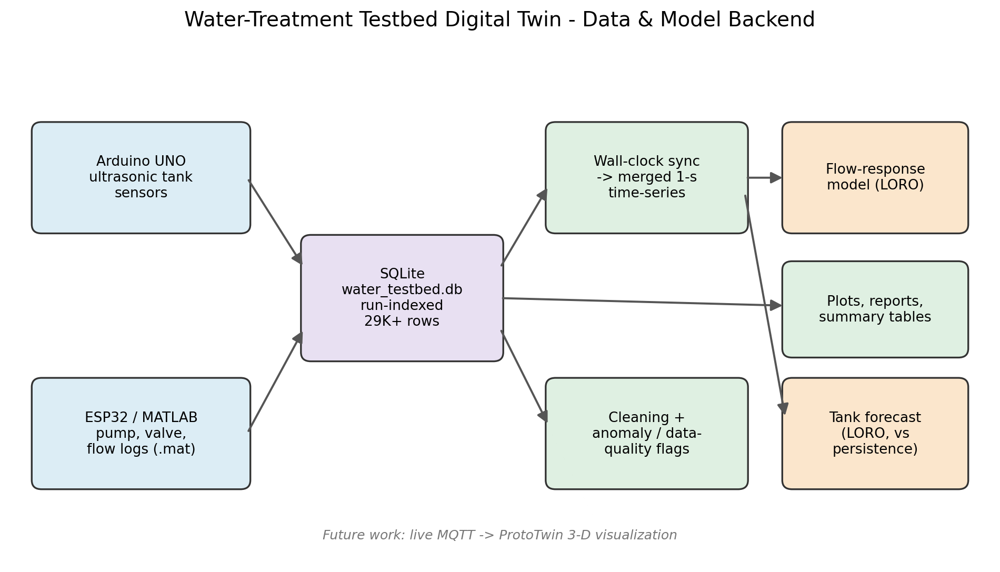
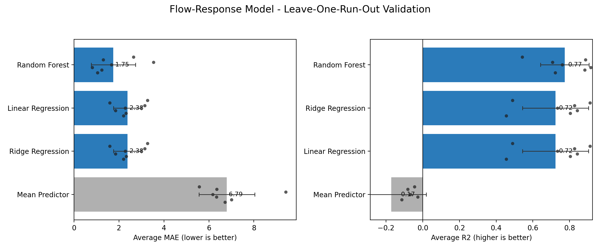
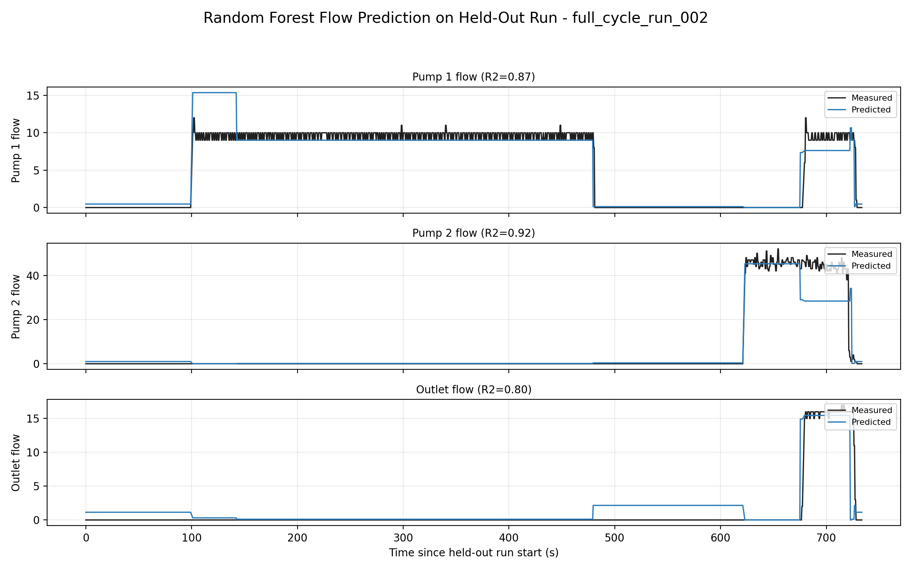
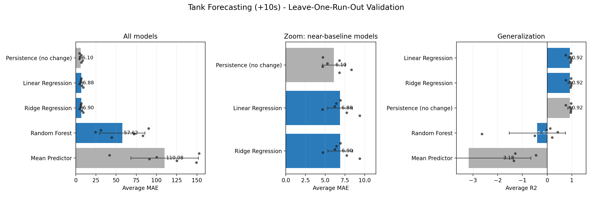
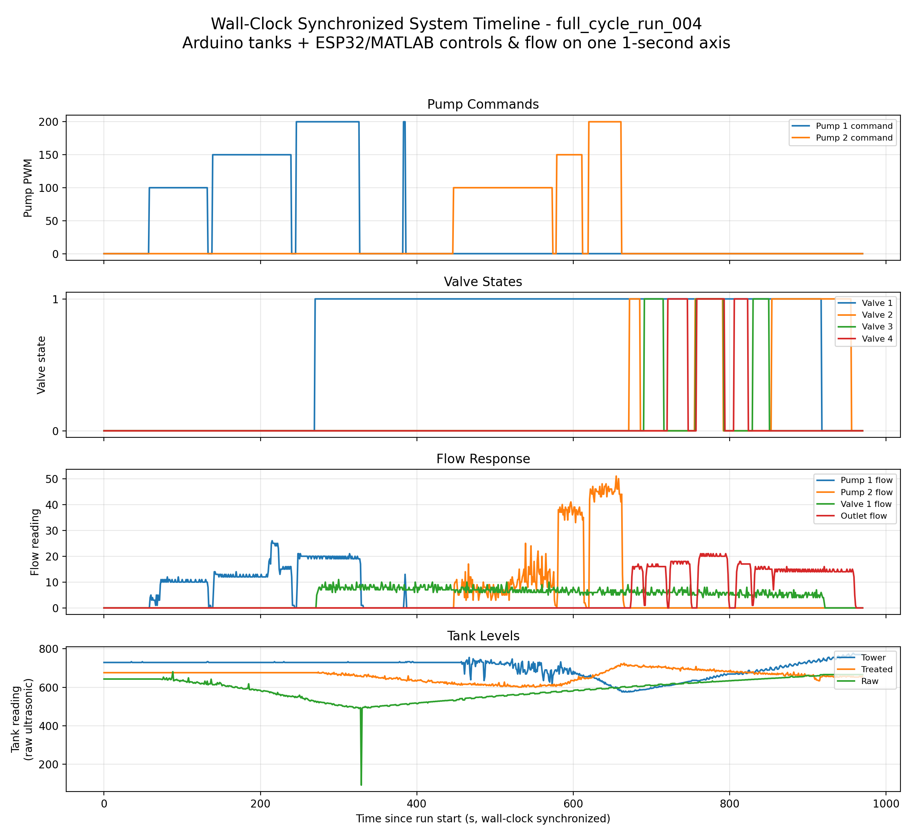

# Water-Treatment Testbed Digital Twin — Data & Model Backend

A reproducible, database-backed IoT pipeline for a physical water-treatment testbed.
It ingests and **wall-clock synchronizes** two independent sensor/actuator streams into a
queryable 1-second time-series, then automates analytics, data-quality flagging, and
**leave-one-run-out–validated** predictive modeling. This is the backend intelligence
layer beneath a future real-time digital-twin visualization.



## What's here
- **Two hardware streams → one database.** Arduino UNO ultrasonic tank sensors and an
  ESP32/MATLAB pump–valve–flow controller, ingested into SQLite with run-level experiment
  tracking. **~15.4K** controller rows + **~14.1K** tank rows across 11 experiments.
- **Wall-clock synchronization.** MATLAB `startWallClock` timestamps align both streams
  onto a shared 1-second grid (`merge_asof`, nearest within ±1–2 s; controls step-held,
  flows/tanks interpolated).
- **Auditable cleaning.** Raw stays in the database; cleaning is a separate, logged step
  (`analysis/cleaning_summary.csv` records rows dropped and why, per run).
- **Automated analytics.** Timeline plots, rule-based anomaly / data-quality detection,
  staged-operation summaries, and cross-run comparison tables.
- **Predictive models.** Two proof-of-concept tasks, both validated leave-one-run-out
  (LORO) — never a random row split, which would leak on autocorrelated 1 Hz data.

## System pathway
- Pump 1: groundwater → raw tank
- Valve 1: raw tank → treated tank
- Pump 2: treated tank → tower tank
- Valves 2/3/4: tower tank → groundwater / output path

## Data pipeline
```
Arduino tank sensors  ─┐
                       ├─► SQLite (water_testbed.db, run-indexed)
ESP32/MATLAB .mat logs ─┘
        │
        ├─► wall-clock sync ─► merged 1-second time-series (exports/*_merged_timeseries.csv)
        ├─► cleaning + anomaly / data-quality flags
        └─► plots, run reports, summary tables, ML models
```

## Database schema
- `runs(run_name PK, run_type, notes, created_at)` — experiment metadata
- `esp32_matlab_data(run_name, timestamp[s], pump1/2_pwm, valve1-4, flow_p1/p2/valve1/outlet)`
- `arduino_tank_data(run_name, timestamp, tank1=tower, tank2=treated, tank3=raw, raw_line)`

## Runs
| Run | Role |
|---|---|
| `full_cycle_run_004`, `_002`, `_003` | Full treatment cycles — poster + models |
| `pump_pwm_sweep_run_001`, `_002` | PWM sweeps — clean control→flow mapping |
| `valve_routing_run_001` | Valve routing — only run exercising valve flows |
| `full_cycle_run_001` | ESP32-only flow modeling (no wall clock → not tank-eligible) |
| `combined_run_001`, `pump1_onoff_run_002`, `live_water_test_1` | Supporting / debug |

`config_test_001` (duplicate import of `combined_run_001`) is excluded from all results.

## Models (leave-one-run-out)

Model bars show mean performance across held-out runs; black dots are individual folds
and whiskers show fold-to-fold standard deviation.

**Flow-response** — predict flows from pump PWM + valve states (7 runs):

| Model | avg MAE | avg R² |
|---|---|---|
| Random Forest | **1.75** | **0.77** |
| Linear / Ridge | 2.38 | 0.72 |
| Mean predictor | 6.79 | −0.17 |

Control states predict multi-channel flow response and **generalize to unseen runs** —
the project's primary ML result.





**Tank forecasting (+10 s)** — predict tank readings 10 s ahead (6 runs). Reported
against a **persistence baseline** (future = current), the honest reference for a
short-horizon forecast:

| Model | avg MAE | avg R² |
|---|---|---|
| Persistence (no change) | **6.10** | 0.918 |
| Linear / Ridge | 6.88 | 0.920 |
| Random Forest | 57.6 | −0.40 |
| Mean predictor | 110.1 | −3.18 |

**Finding:** over a 10 s horizon the tanks are highly autocorrelated, so simple regression
**matches but does not beat persistence** (and adds no skill on the actual 10 s *change*).
This validates the temporal coherence of the merged data and bounds what near-term
prediction can claim. Random forests fail here because trees cannot extrapolate beyond the
training range to a held-out run's tank levels.





## Reproduce
Set `RUN_NAME` / `MAT_FILE` in `config.py`, then:
```
python setup_db.py            # create schema
python mat_to_sqlite.py       # import ESP32/MATLAB .mat  (per run)
python arduino_logger.py      # log Arduino tank stream   (per run, live)
python merge_timeseries.py    # wall-clock synchronized 1-s merge (per run)
python create_clean_model_datasets.py   # build clean model CSVs
python flow_response_model.py            # LORO flow model
python tank_forecasting_model.py         # LORO tank model (with persistence)
python make_poster_figures.py            # regenerate poster figures
```
Analytics: `plot_run.py`, `combined_timeline.py`, `detect_anomalies.py`,
`summarize_anomalies.py`, `run_report.py`, `stage_summary.py`, `compare_runs.py`.

## Limitations
- Small run count (5–6) → high-variance cross-validation; per-run spread reported alongside means.
- Ultrasonic readings are **raw distances, not calibrated volumes** — models predict sensor readings, not liters.
- Synchronization is ±1–2 s; steady-state modeling (no transient/lag features).
- 10 s tank forecasting is autocorrelation-dominated.

## Future work
- Live MQTT → ProtoTwin 3-D visualization (frontend not yet working).
- Sensor → volume calibration; longer-horizon / delta-target forecasting with lag features.
- More runs for tighter validation; closed-loop control experiments.

## Tank mapping
`tank1 = tower`, `tank2 = treated`, `tank3 = raw`. Arduino `"Error"` readings are preserved
in the database and analyzed as data-quality events.
